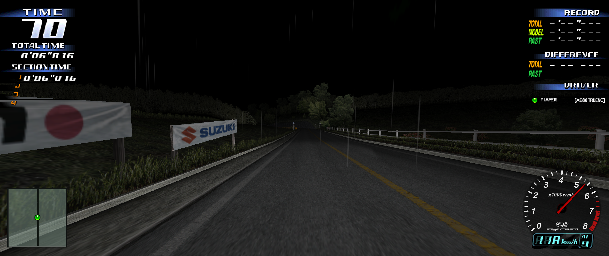

# Initial D Arcade Stage 3 Reimagined

A fan-made Initial D Arcade Stage 3 project for Windows, with Unity rendering and a native C++ gameplay core.

**[Download the game](https://github.com/distilledorion-sketch/Initial-D-Arcade-Stage-3-Reimagined/releases/latest)** · **[Community leaderboard](https://initial-d-leaderboard.initial-d-community-leaderboard.workers.dev)** · **[Report a bug](https://github.com/distilledorion-sketch/Initial-D-Arcade-Stage-3-Reimagined/issues/new/choose)** · **[Changelog](CHANGELOG.md)**

## Play

1. Download the Windows game ZIP from **Releases**.
2. Extract the entire archive into a folder.
3. Run `InitialDUnity.exe`. Keep its data folders and DLLs beside it.

The download includes the runtime assets. You do not need Unity to play. Source-code ZIPs are the development project; use the Windows game ZIP for the playable build.

**Current version:** `0.3.95-community-replays.5` · **Platform:** Windows x64 / Direct3D 11

## Features

- Time Attack, Legend of the Streets, Bunta Challenge and online battles.
- Original course and car selections, plus Hakone and Sadamine.
- Day, night and weather conditions supported by each course.
- Controller, keyboard and supported wheel input.
- Personal saves, progression, tuning and a Full Tune option.
- Community Time Attack rankings with downloadable driving replays.
- Local replay library, camera controls, online opponent POV and replay engine audio.
- Custom race music: import MP3, OGG and WAV files in Select BGM.
- Graphics presets, lower output resolutions and adjustable effects/scenery detail.

This project is a work in progress. Rendering fidelity, performance and multiplayer behavior continue to receive fixes; hardware and course combinations vary.

## Records and replays

While connected, in-game rankings combine the selected save's personal bests with the current community leaderboard. Offline, only that save's personal records appear. Matching published personal times appear once.

New leaderboard submissions require a complete replay and a supported build. Old personal times are preserved locally and are not uploaded retrospectively. Replay telemetry is useful for reviewing a run; it is not authoritative anti-cheat verification.

Personal Online Battle and Legend recordings stay on the player's PC. Only a replay attached to a submitted Time Attack is uploaded. Options > Replays opens the local library and recording controls.

## Build and contribute

See **[BUILDING.md](BUILDING.md)** for the development setup and **[CONTRIBUTING.md](CONTRIBUTING.md)** for bug reports and changes.

The repository includes the runtime assets in `Native/data` and `RuntimeAssets`, along with the Unity project, native source, tests and leaderboard service source. The checkout is several gigabytes. Personal saves, uploaded recordings, credentials and local editor/build caches are excluded.

| Directory | Contents |
|---|---|
| `Assets` | Unity scripts, shaders, resources, scenes and native plugins |
| `Native/src` | Native gameplay, asset loading, menus, audio and renderer bridge |
| `Native/data` | Original runtime data used by the game |
| `RuntimeAssets` | Hakone and Sadamine runtime data |
| `Native/tests` | Native regression tests and isolated gameplay fixtures |
| `Tools` | Local build, staging and asset utilities |
| `Leaderboard` | Community leaderboard service, migrations and tests |

This is an unofficial fan project and is not affiliated with or endorsed by SEGA or the Initial D rights holders. Existing third-party notices and licenses remain applicable; no blanket license is granted over third-party game content.
